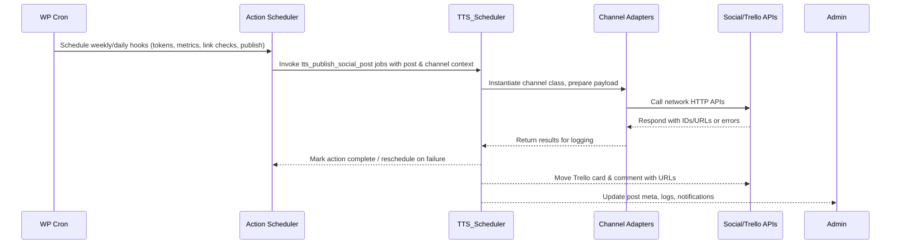
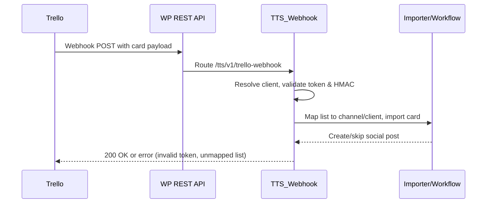

# ADR 2024-04: Architecture Overview

*Author: Francesco Passeri – [francescopasseri.com](https://francescopasseri.com) – [info@francescopasseri.com](mailto:info@francescopasseri.com)*

Applies to plugin version: **0.9.0** and above  
Documentation refresh: **1.0.1**

## Status
Accepted

## Context
- The plugin bootstraps on `plugins_loaded`, validates that the Action Scheduler library is available, loads a curated set of support classes, and wires admin UI objects only in the dashboard, while activation installs logging, workflow, and integration schemas.【F:wp-content/plugins/trello-social-auto-publisher/trello-social-auto-publisher.php†L23-L166】
- Recurring jobs for token refreshes, analytics pulls, link checks, and publishing rely on WP-Cron events delegated to Action Scheduler hooks such as `tts_publish_social_post`.【F:wp-content/plugins/trello-social-auto-publisher/trello-social-auto-publisher.php†L167-L221】
- `TTS_Scheduler` orchestrates approval gating, Action Scheduler queues, media preparation, retry backoffs, Trello board/list mapping, and downstream publisher invocation per social channel class.【F:wp-content/plugins/trello-social-auto-publisher/includes/class-tts-scheduler.php†L20-L413】
- Publisher adapters encapsulate each network’s API (e.g., Facebook Graph), handling credential parsing, HTTP requests, and error reporting via shared logging utilities.【F:wp-content/plugins/trello-social-auto-publisher/includes/publishers/class-tts-publisher-facebook.php†L17-L224】
- Admin controllers register menus, AJAX handlers, and dashboard widgets that surface scheduler state, content sources, and operational tooling.【F:wp-content/plugins/trello-social-auto-publisher/admin/class-tts-admin.php†L27-L200】
- Ancillary subsystems (workflow approvals, integration hub, webhook ingestion, and backups) add their own AJAX endpoints and cron hooks, broadening the surface area beyond the publishing core.【F:wp-content/plugins/trello-social-auto-publisher/includes/class-tts-workflow-system.php†L20-L159】【F:wp-content/plugins/trello-social-auto-publisher/includes/class-tts-integration-hub.php†L153-L2032】【F:wp-content/plugins/trello-social-auto-publisher/includes/class-tts-webhook.php†L20-L339】【F:wp-content/plugins/trello-social-auto-publisher/includes/class-tts-backup.php†L20-L196】
- The lightweight test harness replaces WordPress primitives with PHP stubs, exercises Trello disablement logic, logger normalization, and security audit monitoring to prevent regressions in admin and REST contexts.【F:wp-content/plugins/trello-social-auto-publisher/tests/bootstrap.php†L1-L720】【F:wp-content/plugins/trello-social-auto-publisher/tests/test-disable-trello.php†L7-L118】【F:wp-content/plugins/trello-social-auto-publisher/tests/test-logger.php†L4-L87】【F:wp-content/plugins/trello-social-auto-publisher/tests/test-security-audit.php†L4-L200】

## Decision
We document the current architecture as a composition of WordPress bootstrap hooks, Action Scheduler-driven job orchestration, channel-specific publisher adapters, and an expanded admin/services layer so future changes can target the appropriate extension seams.

### Dependency inversion update
- Introduced `class-tts-operating-contracts.php` with scheduling, integration, credential, and observability interfaces plus value objects so modules exchange normalized payloads instead of raw arrays.【F:wp-content/plugins/trello-social-auto-publisher/includes/class-tts-operating-contracts.php†L14-L429】
- `TTS_Scheduler` now implements `TTS_Scheduler_Interface`, accepts optional `TTS_Integration_Gateway_Interface` and `TTS_Observability_Channel_Interface` dependencies, and routes scheduling/telemetry logic through the new contracts (`queue_from_request`, `release_schedule`, and `publish_social_post`).【F:wp-content/plugins/trello-social-auto-publisher/includes/class-tts-scheduler.php†L17-L205】【F:wp-content/plugins/trello-social-auto-publisher/includes/class-tts-scheduler.php†L379-L436】
- `TTS_Integration_Hub` implements `TTS_Integration_Gateway_Interface`, consumes `TTS_Credential_Provisioner_Interface` and `TTS_Observability_Channel_Interface`, and exposes `dispatch_message()` so upstream modules request syncs without touching concrete methods.【F:wp-content/plugins/trello-social-auto-publisher/includes/class-tts-integration-hub.php†L17-L113】【F:wp-content/plugins/trello-social-auto-publisher/includes/class-tts-integration-hub.php†L115-L176】【F:wp-content/plugins/trello-social-auto-publisher/includes/class-tts-integration-hub.php†L2054-L2080】
- Example: the bootstrapper can instantiate `new TTS_Scheduler( new TTS_Integration_Hub( new TTS_Option_Credential_Provisioner(), new TTS_Logger_Observability_Channel() ), new TTS_Logger_Observability_Channel() )` to wire abstractions end-to-end while keeping modules individually testable.【F:wp-content/plugins/trello-social-auto-publisher/includes/class-tts-operating-contracts.php†L329-L429】【F:wp-content/plugins/trello-social-auto-publisher/includes/class-tts-scheduler.php†L17-L126】【F:wp-content/plugins/trello-social-auto-publisher/includes/class-tts-integration-hub.php†L17-L176】

### Component responsibilities
- **Bootstrapping & activation** – Guard against missing Action Scheduler, load whitelisted includes, and register activation installers for logging, workflow, and integration tables.【F:wp-content/plugins/trello-social-auto-publisher/trello-social-auto-publisher.php†L23-L112】
- **Scheduling & workflow orchestration** – `TTS_Scheduler` listens to custom post saves, schedules per-channel jobs with offsets, manages exponential retry windows, mirrors publish results back to Trello, and exposes queue health checks for admins.【F:wp-content/plugins/trello-social-auto-publisher/includes/class-tts-scheduler.php†L20-L600】
- **Publisher adapters** – Each adapter translates normalized content into the target API (Facebook, Instagram, TikTok, YouTube, Stories, and blog publishing) with shared logging and notifier hooks for success/failure surfaces.【F:wp-content/plugins/trello-social-auto-publisher/includes/class-tts-scheduler.php†L221-L305】【F:wp-content/plugins/trello-social-auto-publisher/includes/publishers/class-tts-publisher-facebook.php†L17-L224】
- **Admin & UI layer** – Menu registration, filters, AJAX endpoints, asset loading, and dashboard widgets let operators drive scheduling, integrations, and reporting from WP-Admin.【F:wp-content/plugins/trello-social-auto-publisher/admin/class-tts-admin.php†L27-L200】
- **Integration, workflow, webhook, and backup services** – Dedicated classes register REST/AJAX endpoints, database tables, and cron schedules for approvals, third-party sync, Trello ingestion, and disaster recovery.【F:wp-content/plugins/trello-social-auto-publisher/includes/class-tts-workflow-system.php†L20-L159】【F:wp-content/plugins/trello-social-auto-publisher/includes/class-tts-integration-hub.php†L153-L2032】【F:wp-content/plugins/trello-social-auto-publisher/includes/class-tts-webhook.php†L20-L339】【F:wp-content/plugins/trello-social-auto-publisher/includes/class-tts-backup.php†L20-L196】
- **Test harness** – Custom bootstrap populates globals, substitutes core functions, resets state between tests, and loads targeted classes to validate admin rendering, logging, and security logic without a full WordPress environment.【F:wp-content/plugins/trello-social-auto-publisher/tests/bootstrap.php†L24-L654】

### External dependencies
- **WordPress core & WP-Cron** provide the lifecycle hooks, custom post types, meta storage, and event scheduler used throughout the plugin.【F:wp-content/plugins/trello-social-auto-publisher/trello-social-auto-publisher.php†L23-L221】【F:wp-content/plugins/trello-social-auto-publisher/includes/class-tts-scheduler.php†L20-L600】
- **Action Scheduler** is mandatory for deferred publishing and integration sync queues; missing the library surfaces admin notices instead of silently failing.【F:wp-content/plugins/trello-social-auto-publisher/trello-social-auto-publisher.php†L55-L61】
- **Social network APIs** (Facebook, Instagram, YouTube, TikTok, blogs) are invoked via `wp_remote_post`/`wp_remote_get`, requiring stored OAuth tokens and respecting per-channel formatting.【F:wp-content/plugins/trello-social-auto-publisher/includes/publishers/class-tts-publisher-facebook.php†L17-L224】
- **Trello API** powers content ingestion (webhooks) and card lifecycle updates when publishing completes, including HMAC validation and list mapping.【F:wp-content/plugins/trello-social-auto-publisher/includes/class-tts-webhook.php†L70-L339】【F:wp-content/plugins/trello-social-auto-publisher/includes/class-tts-scheduler.php†L161-L409】

## Flow mapping (Bootstrap → Scheduler → Publishers → Admin)
1. **Bootstrap** – On load, the plugin instantiates scheduler, notifier, admin, workflow, integration, webhook, backup, and supporting classes, wiring cron and REST/AJAX hooks.【F:wp-content/plugins/trello-social-auto-publisher/trello-social-auto-publisher.php†L64-L221】【F:wp-content/plugins/trello-social-auto-publisher/includes/class-tts-scheduler.php†L20-L622】
2. **Scheduler** – Saving a `tts_social_post` triggers `TTS_Scheduler::schedule_post`, queuing publish actions with channel offsets, retry safeguards, and Trello-to-channel mapping.【F:wp-content/plugins/trello-social-auto-publisher/includes/class-tts-scheduler.php†L32-L199】
3. **Publishers** – Action Scheduler executes `tts_publish_social_post`; `TTS_Scheduler::publish_social_post` prepares media per channel and delegates to channel classes, capturing responses, posting Trello comments, and notifying operators.【F:wp-content/plugins/trello-social-auto-publisher/includes/class-tts-scheduler.php†L221-L418】【F:wp-content/plugins/trello-social-auto-publisher/includes/publishers/class-tts-publisher-facebook.php†L17-L224】
4. **Admin feedback** – Admin pages and dashboards surface queue health, logs, and integration status while content source logic hides unavailable Trello options for editors.【F:wp-content/plugins/trello-social-auto-publisher/admin/class-tts-admin.php†L27-L200】【F:wp-content/plugins/trello-social-auto-publisher/includes/class-tts-content-source.php†L39-L200】【F:wp-content/plugins/trello-social-auto-publisher/tests/test-disable-trello.php†L7-L118】

### Cron-driven workflow

The diagram mirrors the scheduled events defined in the bootstrapper and scheduler, covering retries, Trello updates, and admin notifications.【F:wp-content/plugins/trello-social-auto-publisher/trello-social-auto-publisher.php†L167-L221】【F:wp-content/plugins/trello-social-auto-publisher/includes/class-tts-scheduler.php†L221-L418】

### Webhook processing

This flow highlights the credential lookup, signature validation, and card-to-client mapping performed inside `TTS_Webhook` before delegating to import routines.【F:wp-content/plugins/trello-social-auto-publisher/includes/class-tts-webhook.php†L70-L338】

### Backup process
| Step | Actor | Description |
| --- | --- | --- |
| 1 | Admin AJAX | `tts_create_backup` request validates nonce/permissions and selects backup scope. |
| 2 | Backup service | Collects settings, clients, logs, posts, and media metadata from WPDB, saving JSON to a dedicated directory. |
| 3 | Compression | Backup file is compressed, original JSON removed, and event logged for operators. |
| 4 | Automation | Daily cron ensures `tts_daily_backup` runs automatically when not manually triggered. |
| 5 | Restore/download | Complementary AJAX endpoints enable download, restore, listing, and deletion routines. |

Each step corresponds to hooks and helpers in `TTS_Backup`, including the daily cron registration and data gathering helpers.【F:wp-content/plugins/trello-social-auto-publisher/includes/class-tts-backup.php†L20-L196】

## Extendibility gaps
- Hard-coded include lists and direct instantiation mean new services or publishers require edits to the bootstrapper rather than relying on discovery or registration hooks.【F:wp-content/plugins/trello-social-auto-publisher/trello-social-auto-publisher.php†L64-L166】
- Publisher discovery is convention-based; adding a channel requires file naming that matches scheduler expectations and offers no feature-flag or capability negotiation across adapters.【F:wp-content/plugins/trello-social-auto-publisher/includes/class-tts-scheduler.php†L221-L305】
- Trello mapping logic is duplicated between webhook ingestion and scheduler fallback, increasing drift risk when adjusting channel routing rules.【F:wp-content/plugins/trello-social-auto-publisher/includes/class-tts-scheduler.php†L161-L205】【F:wp-content/plugins/trello-social-auto-publisher/includes/class-tts-webhook.php†L200-L276】
- The custom test harness stubs only a subset of WordPress APIs, limiting coverage for REST permissions, Action Scheduler integration, and real HTTP interactions.【F:wp-content/plugins/trello-social-auto-publisher/tests/bootstrap.php†L24-L654】
- Cron-heavy services (integration hub, backup, workflow notifications) operate independently, lacking centralized observability or backpressure controls beyond manual queue checks.【F:wp-content/plugins/trello-social-auto-publisher/includes/class-tts-integration-hub.php†L153-L2032】【F:wp-content/plugins/trello-social-auto-publisher/includes/class-tts-backup.php†L20-L196】【F:wp-content/plugins/trello-social-auto-publisher/includes/class-tts-scheduler.php†L421-L602】

## Consequences
- ✅ Clear separation between orchestration (scheduler), adapters (publishers), and surfaces (admin/UI) simplifies targeted maintenance when channels or UI features change.【F:wp-content/plugins/trello-social-auto-publisher/includes/class-tts-scheduler.php†L20-L418】【F:wp-content/plugins/trello-social-auto-publisher/admin/class-tts-admin.php†L27-L200】
- ✅ The plugin exposes numerous extension points (AJAX, REST, cron) that third-party modules or future features can hook into without altering core logic.【F:wp-content/plugins/trello-social-auto-publisher/includes/class-tts-webhook.php†L20-L339】【F:wp-content/plugins/trello-social-auto-publisher/includes/class-tts-integration-hub.php†L153-L2032】
- ⚠️ Tight coupling to Action Scheduler and manual instantiation increases startup cost and complicates partial deployments (e.g., CLI-only environments) when dependencies are unavailable.【F:wp-content/plugins/trello-social-auto-publisher/trello-social-auto-publisher.php†L55-L166】
- ⚠️ Distributed cron jobs across multiple services heighten the risk of silent drift or missed executions without consolidated monitoring beyond manual queue checks.【F:wp-content/plugins/trello-social-auto-publisher/includes/class-tts-scheduler.php†L421-L602】【F:wp-content/plugins/trello-social-auto-publisher/includes/class-tts-integration-hub.php†L153-L2032】【F:wp-content/plugins/trello-social-auto-publisher/includes/class-tts-backup.php†L20-L196】

## Future work
- Introduce a service registry or dependency container so new publishers and services self-register rather than editing the bootstrap whitelist.【F:wp-content/plugins/trello-social-auto-publisher/trello-social-auto-publisher.php†L64-L166】
- Extract common Trello mapping logic into a shared utility to keep webhook ingestion and scheduler fallback consistent.【F:wp-content/plugins/trello-social-auto-publisher/includes/class-tts-scheduler.php†L161-L205】【F:wp-content/plugins/trello-social-auto-publisher/includes/class-tts-webhook.php†L200-L276】
- Expand automated tests with a WordPress integration harness (or Action Scheduler mocks) to validate cron execution paths and REST permissions end-to-end.【F:wp-content/plugins/trello-social-auto-publisher/tests/bootstrap.php†L24-L654】
- Centralize cron observability (e.g., admin dashboard summary or health endpoint) spanning publishing, integration sync, and backup queues to reduce operational blind spots.【F:wp-content/plugins/trello-social-auto-publisher/includes/class-tts-scheduler.php†L421-L602】【F:wp-content/plugins/trello-social-auto-publisher/includes/class-tts-integration-hub.php†L153-L2032】【F:wp-content/plugins/trello-social-auto-publisher/includes/class-tts-backup.php†L20-L196】

## References
- [docs/architecture/target-operating-model.md](../architecture/target-operating-model.md)
- [docs/architecture/dependency-injection.md](../architecture/dependency-injection.md)
- [README.md](../../README.md)
- [CHANGELOG.md](../../CHANGELOG.md)
